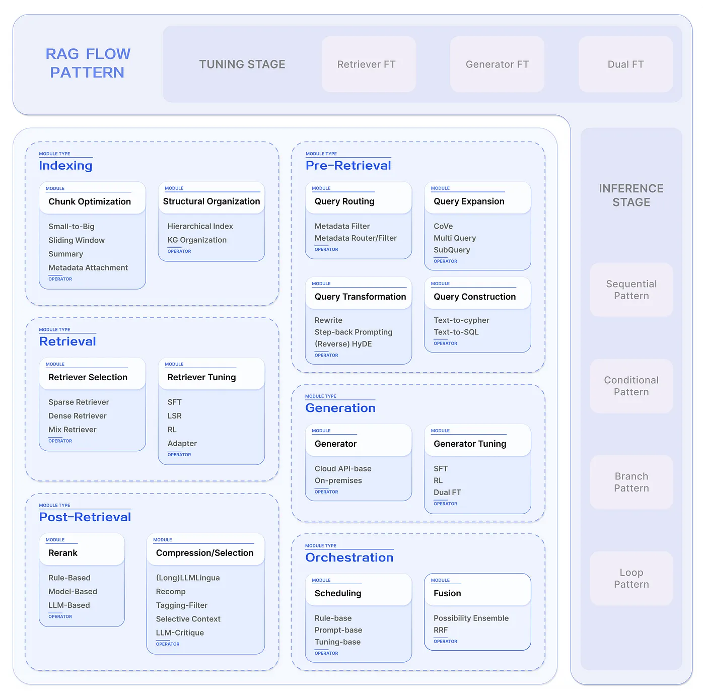

# Modular-RAG-Toolkit

Comfy-UI-inspired RAG Modules for implementing custom LLM applications

Try it in the [demo site](https://www.google.com).




## Features

## Nodes Provided


## Installation


## Resources


## How to use this demo

The demo includes some examples of graphs. 

You need `git`, `node` and `npm`. Given those dependencies are installed, run the following commands to try it out:
```sh
$ git clone https://github.com/jagenjo/litegraph.js.git
$ cd litegraph.js
$ npm install
$ node utils/server.js
>>
Example app listening on http://127.0.0.1:8000
```
Open your browser and point it to http://127.0.0.1:8000. You can select a demo from the dropdown at the top of the page.


### Articles on 'Modular Rag':

- [Modular Rag and Rag Flow, Part I](https://medium.com/@yufan1602/modular-rag-and-rag-flow-part-%E2%85%B0-e69b32dc13a3)

- [Modular Rag and Rag Flow, Part II](https://medium.com/@yufan1602/modular-rag-and-rag-flow-part-ii-77b62bf8a5d3)

### Github Repos which inspired me:

- [AutoRAG, for finding the optimal RAG pipeline for your data](https://github.com/Marker-Inc-Korea/AutoRAG)

- [Litegraph, a graph node engine and editor written in Javascript similar to PD or UDK Blueprints, comes with its own editor in HTML5 Canvas2D. The engine can run client side or server side using Node. It allows to export graphs as JSONs to be included in applications independently. Famously in ComfyUI.](https://github.com/jagenjo/litegraph.js)

- [Ragas, an evaluation framework for your Retrieval Augmented Generation (RAG) pipelines](https://github.com/explodinggradients/ragas)

- [Best-README-Template, for READMEs like this one](https://github.com/othneildrew/Best-README-Template)
<!--git reset --hard HEAD^ -->
<!--git push origin -f -->